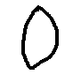
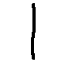

$$
dY^T = {(dY)}^T
$$

$$
dX^T = {(dX)}^T \tag{95}
$$

$$
a\tag{95}
$$

```
from pandocfilters import toJSONFilter, Math, Para, Image, RawInline
import sys
import re

def process(key, value, _format, _meta):
  if key == "RawInline":
    [format, source] = value
    imageSource = re.search('', source).group(1)
    if imageSource:
      return Image(['',[],[]],[],[imageSource, ''])
  elif key == "Math":
    [fmt, code] = value
    searchRe = re.search(r'(\s*\\tag{)(\d+)(})', code)
    if searchRe != None:
      code = code.replace(searchRe.group(), '\\#(' + searchRe.group(2) + ')')
      return Math(fmt, code)
    
    # sys.stderr.write(str(code))

if __name__ == "__main__":
  toJSONFilter(process)
```

`Python` Code:

```python
from pandocfilters import toJSONFilter, Math, Para, Image, RawInline
import sys
import re

def process(key, value, _format, _meta):
  if key == "RawInline":
    [format, source] = value
    imageSource = re.search('', source).group(1)
    if imageSource:
      return Image(['',[],[]],[],[imageSource, ''])
  elif key == "Math":
    [fmt, code] = value
    searchRe = re.search(r'(\s*\\tag{)(\d+)(})', code)
    if searchRe != None:
      code = code.replace(searchRe.group(), '\\#(' + searchRe.group(2) + ')')
      return Math(fmt, code)
    
    # sys.stderr.write(str(code))

if __name__ == "__main__":
  toJSONFilter(process)
```

|公式序号|函数|导数|备注|
|---|---|---|---|
|1|$y=c$|$y'=0$|
|2|$y=x^a$|$y'=ax^{a-1}$|
|3|$y=log_ax$|$y'=\frac{1}{x}log_ae=\frac{1}{xlna}$|
|4|$y=lnx$|$y'=\frac{1}{x}$|